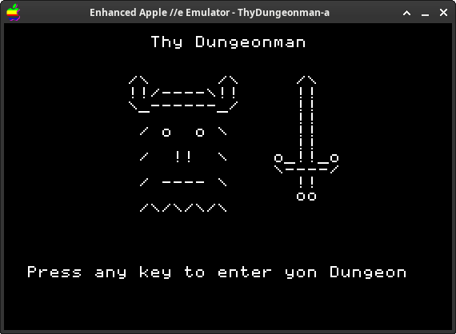

# Thy Dungeonman demake
A demake of Thy Dungeonman for the Apple II and IIe

# Building
Building Thy Dungeonman requires [Make](https://www.gnu.org/software/make/) and [cc65](https://cc65.github.io/).

To build it for Apple IIe (default), run `make disk`. This will use `cl65` to compile, assemble, and link it, and [AppleCommander](https://applecommander.github.io/) to generate an Apple IIe ProDOS disk image. To build it for Apple II, run `make disk TARGET=apple2`.

Then open the created `ThyDungeonman-apple2enh.po` or `ThyDungeonman-apple2.po` in your Apple II emulator.

You can technically also build it for Commodore 64 by running `make TARGET=c64`, but this may lead to things printing weird, or undefined behavior.